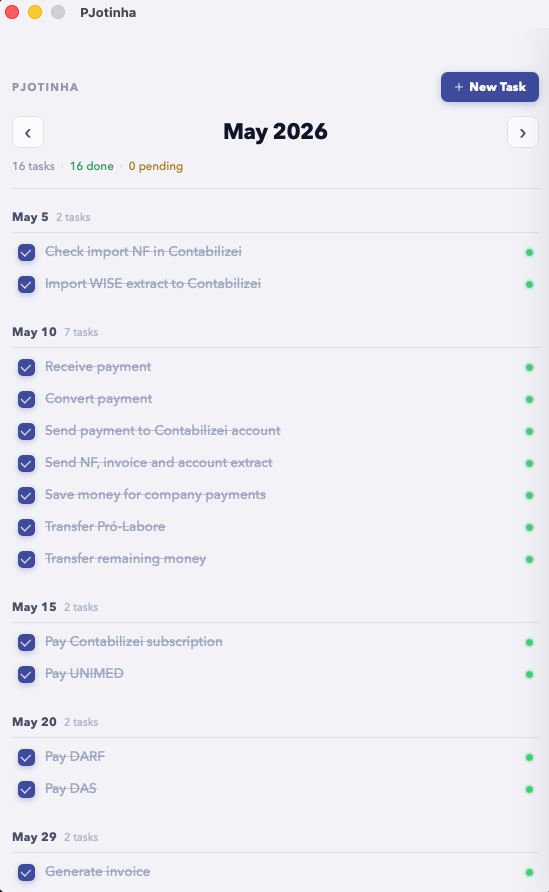

<p align="center">
  
</p>

<h1 align="center">PJotinha</h1>

<p align="center">
  Minimal macOS task manager for PJ (freelancer/CNPJ) monthly obligations.<br/>
  Built with <strong>Tauri</strong> · <strong>React</strong> · <strong>TypeScript</strong>
</p>

<p align="center">
  
</p>

---

## What it does

PJotinha tracks your recurring monthly PJ obligations — invoices, taxes, payments, accounting documents — in a clean, grouped-by-date view.

- **Monthly view** — navigate months with arrow keys, see only what's due that month
- **Grouped by date** — tasks organized by due date, not a flat list
- **Recurring tasks** — set a task to repeat every month automatically (exact day, last business day, or last day of month)
- **Local-first** — all data lives on your machine via Tauri's embedded SQLite + localStorage fallback
- **No accounts, no cloud, no telemetry**

## Stack

| Layer | Tech |
|-------|------|
| Shell | [Tauri v2](https://tauri.app) (Rust) |
| UI | React 18 + TypeScript |
| Build | Vite |
| Persistence | Tauri SQLite plugin + localStorage fallback |
| Styling | Plain CSS (no framework) |

## Running locally

```bash
# Install dependencies
npm install

# Dev mode (hot reload)
npm run tauri dev

# Production build
npm run tauri build
```

Requires [Rust](https://rustup.rs) and the [Tauri prerequisites](https://tauri.app/start/prerequisites/) for your platform.

## Project structure

```
src/
  App.tsx                  # Main view — month nav, grouped task list
  features/tasks/
    TaskSheet.tsx          # Slide-in panel for create/edit
    mockTasks.ts           # Seed data
  lib/date.ts              # Date formatting helpers
  types/task.ts            # Task type definitions
src-tauri/
  src/lib.rs               # Tauri commands (load/save state)
  tauri.conf.json          # App config
```

## License

MIT
